# 企业信息展示小程序工程

> 鑫川针织公司产品展示系统 — 福软 VibeCoding 课程第一阶段作业

基于 Spring Boot 3.2.5 后端和微信小程序前端的企业信息展示系统，支持产品管理、新闻 CMS、公告、Banner 轮播等 6 实体完整 CRUD，Docker 容器化部署和微信云托管。

## 项目结构

```
xgzz-20260522-v2/
├── backend/                        # Spring Boot 后端服务
│   ├── src/main/java/com/company/miniprogram/
│   │   ├── config/                 # SecurityConfig, JwtFilter, WebConfig, CacheConfig, RateLimitInterceptor, OpenApiConfig
│   │   ├── controller/             # REST API 控制器（公有 /api/*, 管理 /api/admin/*）
│   │   ├── service/                # 业务逻辑层
│   │   ├── repository/             # Spring Data JPA 数据访问层
│   │   ├── model/                  # JPA 实体类 (@Entity)
│   │   ├── dto/                    # ApiResponse<T>, PageResponse<T>
│   │   ├── exception/              # GlobalExceptionHandler
│   │   └── util/                   # JwtUtil
│   ├── src/main/resources/
│   │   ├── application.yml         # 开发环境配置
│   │   ├── logback-spring.xml      # 日志配置
│   │   └── static/admin/index.html # 管理后台 SPA
│   ├── src/test/java/              # 集成测试 + 单元测试（H2 内存库）
│   ├── uploads/                    # 上传文件存储目录
│   ├── Dockerfile                  # Docker 镜像构建
│   ├── cloudbaserc.json            # 微信云托管配置
│   ├── nginx.conf                  # Nginx 反向代理配置
│   └── pom.xml                     # Maven 依赖配置
├── miniprogram/                    # 微信小程序前端
│   ├── app.js                      # 应用入口
│   ├── app.json                    # 应用配置（tabBar 4 页签）
│   ├── app.wxss                    # 全局样式
│   ├── config.js                   # 环境配置（dev/prod baseUrl）
│   ├── request.js                  # API 请求封装
│   ├── utils.wxs                   # WXS 工具模块
│   ├── pages/                      # 10 个页面
│   │   ├── index/                  # 首页
│   │   ├── category/               # 产品分类
│   │   ├── products/               # 所有产品
│   │   ├── contact/                # 联系我们
│   │   ├── product-detail/         # 产品详情
│   │   ├── news-list/              # 新闻列表
│   │   ├── news-detail/            # 新闻详情
│   │   ├── announcement-list/      # 公告列表
│   │   ├── announcement-detail/    # 公告详情
│   │   └── company-info/           # 公司详情
│   ├── images/                     # 图标资源
│   └── tests/                      # Jest 单元测试
├── assist/                         # 辅助脚本与测试资源
│   ├── start/deploy-windows.bat    # Windows 部署脚本
│   └── test/                       # Postman 测试集
├── .github/workflows/ci.yml        # GitHub Actions CI
├── checkstyle.xml                  # Checkstyle 规则
└── screenshots/                    # 界面截图
```

## 技术栈

### 后端
- **框架**: Spring Boot 3.2.5
- **语言**: Java 17
- **数据库**: MySQL 8.0+
- **ORM**: Spring Data JPA + Hibernate
- **安全**: Spring Security + JWT (jjwt 0.12.5)
- **缓存**: Spring Cache + Caffeine
- **限流**: Bucket4j
- **API 文档**: springdoc-openapi (Swagger UI)
- **构建工具**: Maven 3.8+
- **容器化**: Docker
- **云托管**: 微信云托管（CloudBase）

### 前端
- **框架**: 微信小程序原生框架
- **开发工具**: 微信开发者工具
- **测试**: Jest + miniprogram-simulate

## 快速开始

```bash
# 1. 创建数据库
mysql -u root -p -e "CREATE DATABASE company_miniprogram CHARACTER SET utf8mb4 COLLATE utf8mb4_unicode_ci;"

# 2. 启动后端
cd backend && mvn spring-boot:run

# 3. 打开管理后台 → http://localhost:8080/admin/index.html
#    默认账号: admin / admin123
# 4. 打开微信开发者工具 → 导入 miniprogram/ 目录 → 勾选"不校验合法域名" → 编译运行
```

## 功能模块

### 小程序端
| 页面 | 功能 |
|------|------|
| 首页 | 轮播图、公司信息、新闻资讯、公告、快捷入口 |
| 产品分类 | 产品分类列表及分类下的产品 |
| 所有产品 | 产品搜索、筛选、分页展示、产品详情 |
| 新闻列表/详情 | 新闻资讯列表及详情展示 |
| 公告列表/详情 | 公告列表及详情展示 |
| 公司详情 | 企业详细信息展示 |
| 联系我们 | 联系方式、地图展示、拨打电话、导航 |

### 管理端
| 模块 | 功能 |
|------|------|
| 管理员认证 | JWT Token 登录 |
| 产品管理 | 新增、编辑、删除产品 |
| 分类管理 | 新增、编辑、删除产品分类 |
| 新闻管理 | 新增、编辑、删除新闻 |
| 公告管理 | 新增、编辑、删除公告 |
| 轮播图管理 | 新增、编辑、删除轮播图 |
| 公司信息管理 | 编辑公司信息 |
| 文件上传 | 图片上传 |

## 界面截图

### 管理端界面

| 首页 | 轮播图管理 | 分类管理 |
|------|-----------|---------|
| 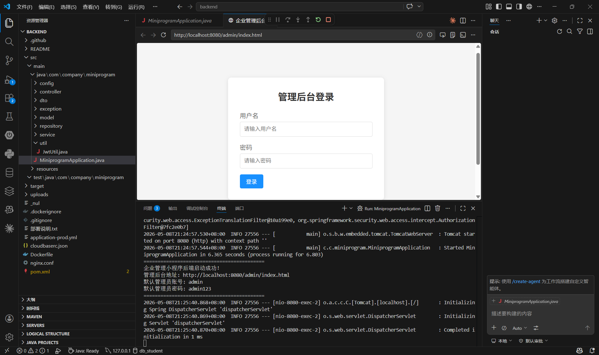 | 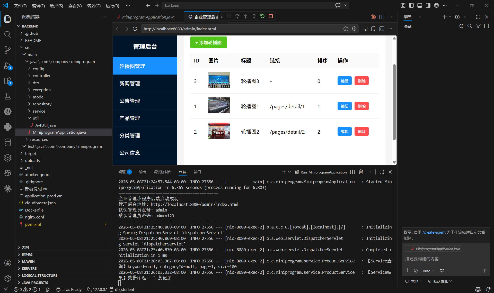 | 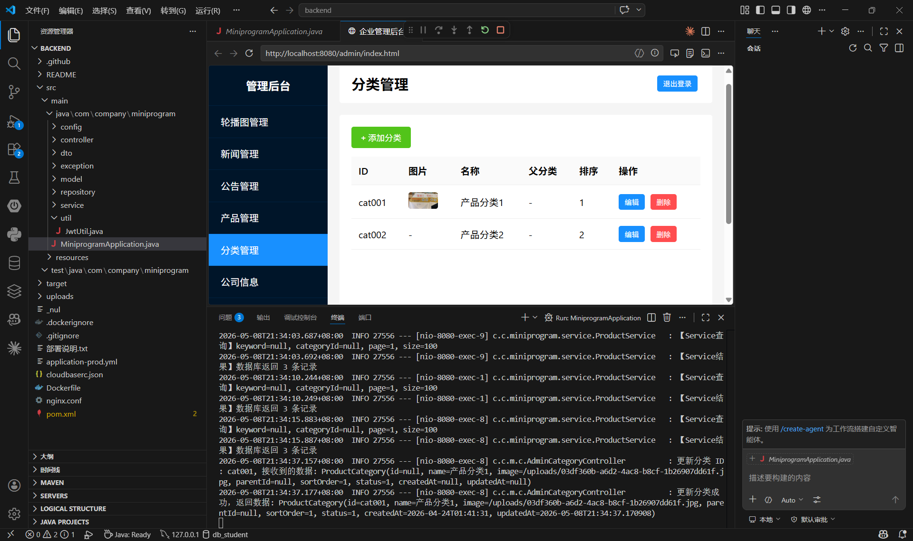 |

| 产品管理 | 新闻管理 | 公告管理 | 公司信息管理 |
|---------|---------|---------|------------|
| 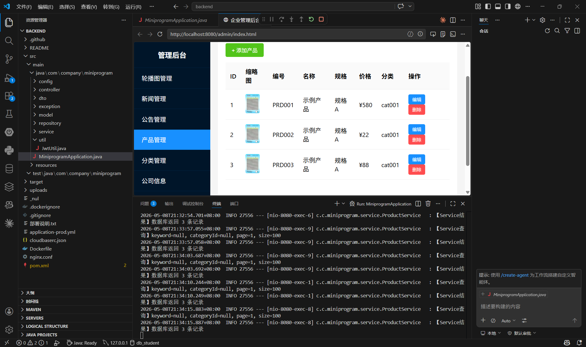 | 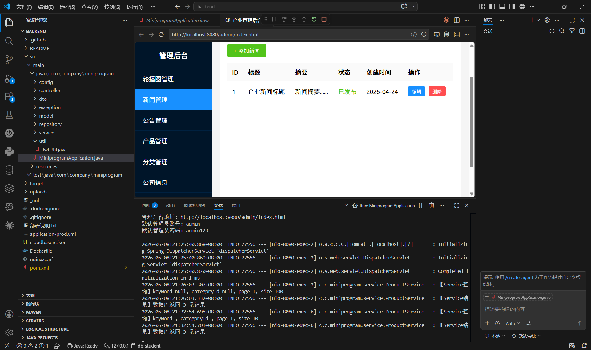 | 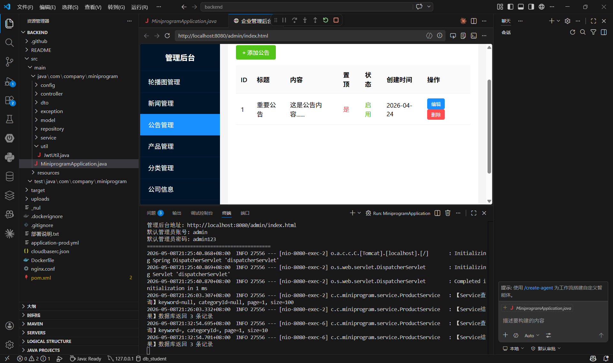 | 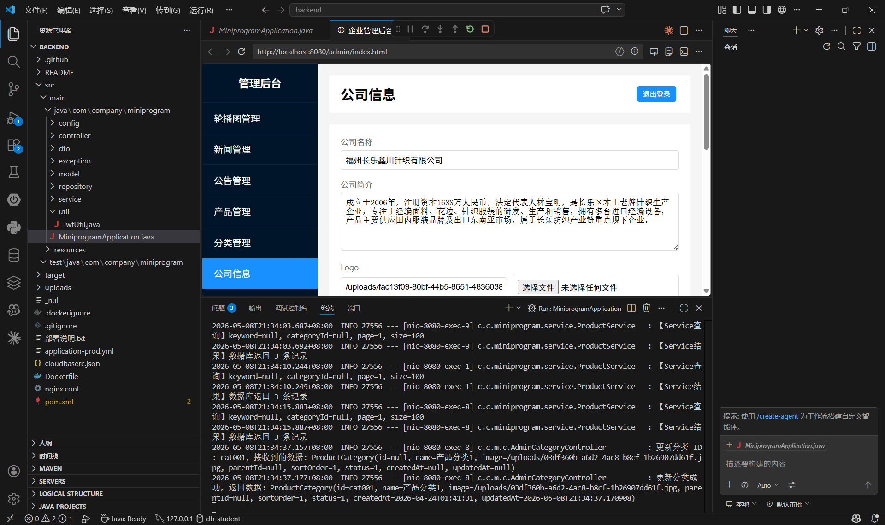 |

### 小程序界面

| 首页 | 分类信息 | 产品信息 | 产品详情 | 公司信息 |
|------|---------|---------|---------|---------|
| 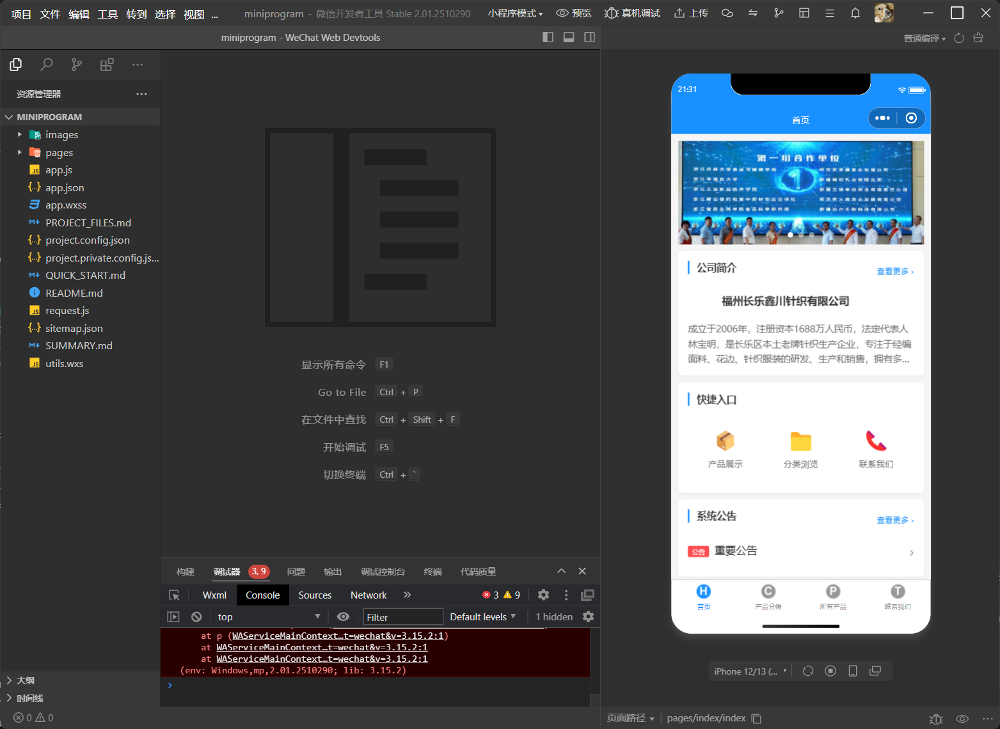 | 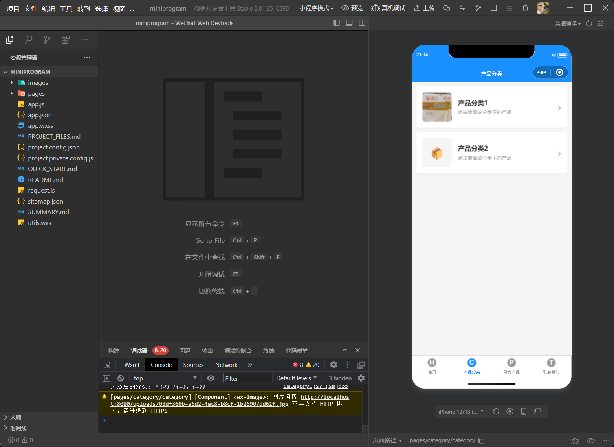 | 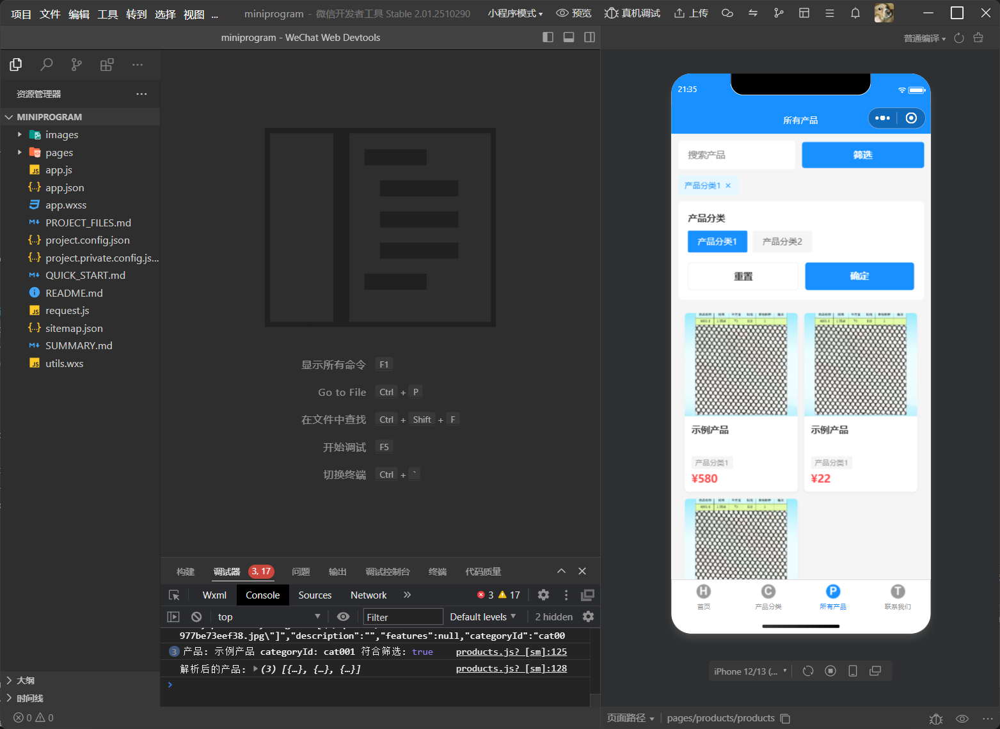 | 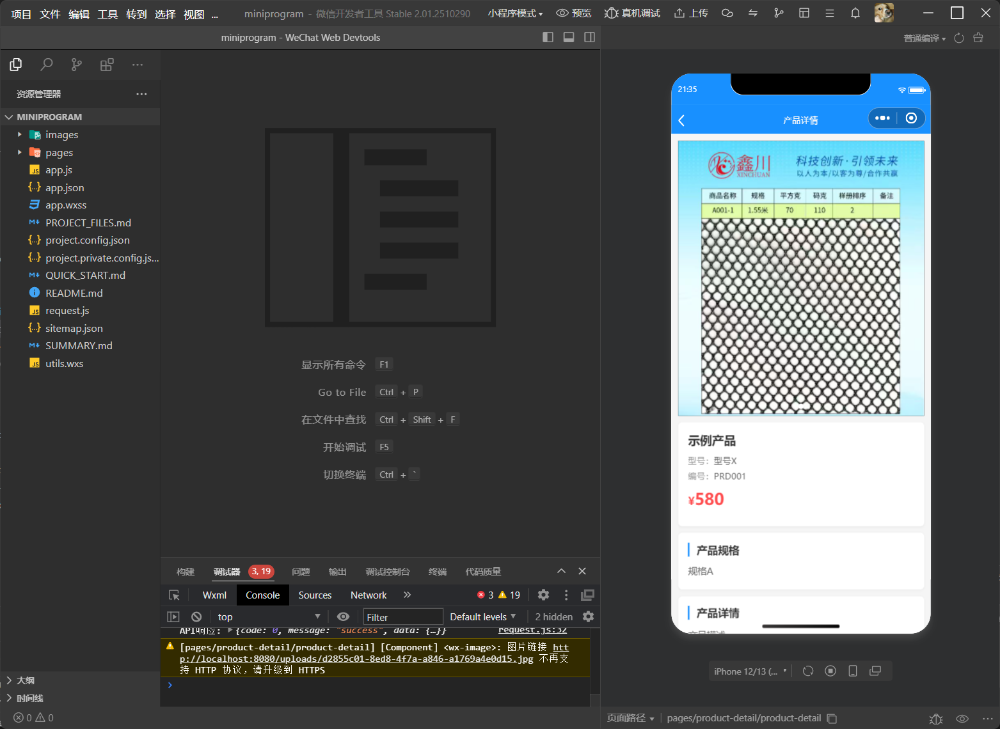 | 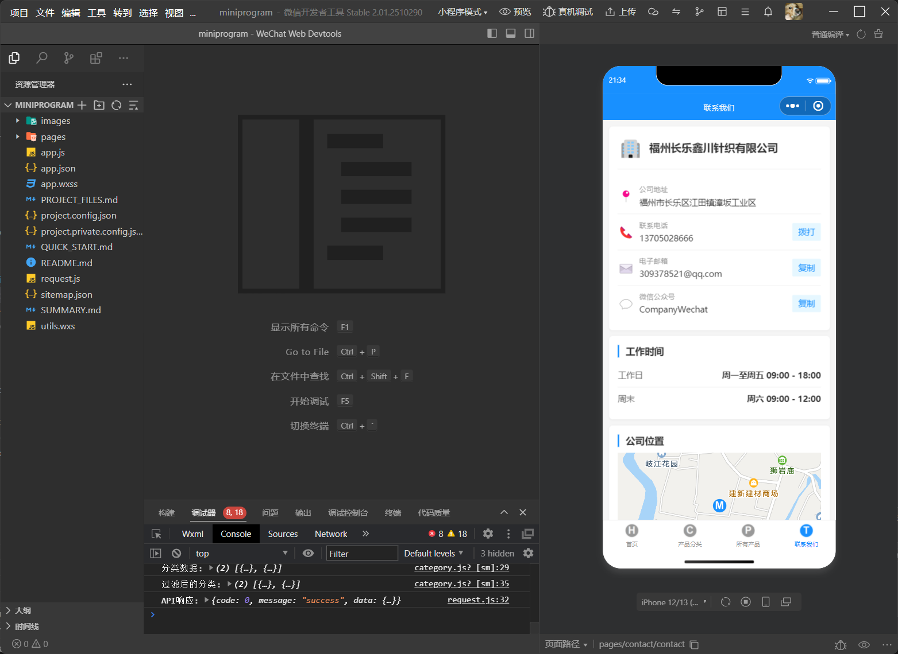 |

## 环境要求

### 后端
- JDK 17 或更高版本
- Maven 3.8+
- MySQL 8.0+

### 前端
- 微信开发者工具

## 运行说明

### 1. 数据库配置

```sql
CREATE DATABASE company_miniprogram CHARACTER SET utf8mb4 COLLATE utf8mb4_unicode_ci;
```

### 2. 后端运行

```bash
cd backend

# 修改 src/main/resources/application.yml 中的数据库配置
# 配置 MySQL 连接信息：
#   - 数据库名: company_miniprogram
#   - 用户名: your_username
#   - 密码: your_password

# 编译并启动
mvn spring-boot:run
```

后端启动后访问：
- API 地址: http://localhost:8080
- 管理后台: http://localhost:8080/admin/index.html
- Swagger 文档: http://localhost:8080/swagger-ui.html

### 3. 小程序前端运行

1. 安装微信开发者工具
2. 打开 `miniprogram` 项目目录
3. 设置项目 AppID（可使用测试号）
4. 修改 `config.js` 中的环境配置（如需要）：
   ```javascript
   // 开发环境默认已配置 http://localhost:8080
   // 切换到生产环境修改 CURRENT_ENV 为 'production' 并设置对应 baseUrl
   ```
5. 在微信开发者工具中勾选"不校验合法域名"（开发环境）
6. 编译运行

### 4. 默认账号

- **用户名**: `admin`
- **密码**: `admin123`

> 首次登录后请立即修改默认密码！

## 测试

### 后端测试

```bash
cd backend

# 运行所有测试
mvn test

# 运行测试并生成覆盖率报告（JaCoCo）
mvn verify

# 查看覆盖率报告
# target/site/jacoco/index.html
```

后端测试使用 H2 内存数据库，无需连接真实 MySQL。覆盖率要求最低 35%。

### 前端测试

```bash
cd miniprogram
npm install
npm test
```

## 代码质量

项目集成以下代码质量工具（通过 Maven 和 CI 执行）：

| 工具 | 用途 | 配置 |
|------|------|------|
| JaCoCo | 代码覆盖率 | 最低 35% 行覆盖率 |
| Checkstyle | 代码风格检查 | `checkstyle.xml` |
| SpotBugs | 静态缺陷检测 | Low 阈值，Max 努力 |

## CI/CD

项目配置了 GitHub Actions 自动化流水线（`.github/workflows/ci.yml`）：

- **触发条件**: 推送到 `main`/`master`/`cc` 分支，或 PR 到 `main`/`master`
- **流水线步骤**: 编译 → 测试 → 测试报告 → Checkstyle → 打包
- Checkstyle 结果为 `continue-on-error`，不阻塞构建

## 部署说明

### 方式一：Windows 服务器部署

```cmd
# 使用部署脚本（以管理员身份运行）
assist\start\deploy-windows.bat

# 或手动部署
cd backend
mvn clean package -DskipTests
java -jar target\wxzz-prod-1.0.0.jar --server.port=8080
```

### 方式二：Docker 部署

```bash
cd backend

# 构建镜像
mvn clean package -DskipTests
docker build -t miniprogram-backend .

# 运行容器
docker run -d \
  -p 8080:8080 \
  -e SPRING_DATASOURCE_URL=jdbc:mysql://host:3306/company_miniprogram \
  -e SPRING_DATASOURCE_USERNAME=root \
  -e SPRING_DATASOURCE_PASSWORD=your_password \
  -v ./uploads:/app/uploads \
  miniprogram-backend
```

### 方式三：微信云托管部署

项目已配置 `cloudbaserc.json`，可直接通过微信云托管控制台部署，数据库连接通过 Secret 配置。

### Nginx 反向代理（可选）

项目提供 `nginx.conf` 配置文件，可用于 Nginx 反向代理：
```bash
sudo cp nginx.conf /etc/nginx/sites-available/miniprogram-backend
sudo ln -s /etc/nginx/sites-available/miniprogram-backend /etc/nginx/sites-enabled/
sudo nginx -t && sudo systemctl restart nginx
```

## 主要配置

### 后端配置

| 配置文件 | 用途 |
|----------|------|
| `application.yml` | 开发环境默认配置 |
| `application-prod.yml` | 生产环境配置（支持环境变量覆盖） |
| `logback-spring.xml` | 日志配置 |

| 配置项 | 默认值（开发环境） | 说明 |
|--------|--------|------|
| server.port | 8080 | 服务端口 |
| spring.datasource.url | jdbc:mysql://localhost:3306/company_miniprogram | 数据库连接 |
| spring.datasource.username | root | 数据库用户名 |
| spring.datasource.password | 通过 `SPRING_DATASOURCE_PASSWORD` 环境变量设置 | 数据库密码 |
| jwt.secret | 通过 `JWT_SECRET` 环境变量设置 | JWT 签名密钥（生产务必更换） |
| jwt.expiration | 86400000 | Token 有效期（毫秒，24小时） |
| admin.username | admin | 管理员用户名（通过 `ADMIN_USERNAME` 覆盖） |
| admin.password | 通过 `ADMIN_PASSWORD` 环境变量设置 | 管理员密码（生产务必修改） |

> 生产环境请通过环境变量注入所有敏感配置，详见 [环境变量清单](#环境变量清单)

### 前端配置 (config.js)

| 配置项 | 说明 |
|--------|------|
| baseUrl | 后端 API 地址，开发环境默认 `http://localhost:8080`，生产环境修改为实际域名 |

部署前在 `miniprogram/config.js` 中将 `CURRENT_ENV` 切换为 `production` 并修改对应的 `baseUrl`。`miniprogram/utils.wxs` 中的 `BASE_URL` 也需同步修改。

## API 接口

### 小程序端接口
- `GET /api/banner/list` - 获取轮播图
- `GET /api/company/info` - 获取公司信息
- `GET /api/company/news` - 获取新闻列表
- `GET /api/company/announcement` - 获取公告列表
- `GET /api/product/categories` - 获取产品分类
- `GET /api/product/list` - 获取产品列表
- `GET /api/product/detail/{id}` - 获取产品详情
- `GET /api/contact/info` - 获取联系方式

### 管理端接口
- `POST /api/admin/login` - 管理员登录
- 产品、分类、新闻、公告、轮播图、公司信息的增删改查接口
- `POST /api/upload` - 文件上传

> 完整 API 文档可通过 Swagger UI 查看：http://localhost:8080/swagger-ui.html

## 数据库表结构

| 表名 | 说明 |
|------|------|
| company_info | 公司基本信息 |
| product_category | 产品分类 |
| product | 产品信息 |
| news | 新闻资讯 |
| announcement | 公告信息 |
| banner | 轮播图 |

## 注意事项

1. **图片路径**: 后端返回的图片路径为相对路径，前端会自动拼接基础 URL
2. **分页加载**: 产品列表使用分页加载，页码从 1 开始
3. **网络请求**: 开发环境下需在微信开发者工具中勾选"不校验合法域名"
4. **地图功能**: 生产环境需要配置地图服务权限
5. **安全提醒**: 生产环境务必修改默认管理员密码和 JWT 密钥
6. **生产配置**: 生产环境建议使用 `application-prod.yml`，通过环境变量覆盖敏感配置
7. **API 限流**: 后端已集成 Bucket4j 限流，防止接口被恶意刷调用
8. **缓存**: Caffeine 缓存已启用，减少数据库查询压力

## 环境变量清单

生产环境需通过环境变量注入以下敏感配置：

| 环境变量 | 说明 | 示例 |
|----------|------|------|
| `SPRING_DATASOURCE_URL` | 数据库连接地址 | `jdbc:mysql://host:3306/company_miniprogram?...` |
| `SPRING_DATASOURCE_USERNAME` | 数据库用户名 | `app_user` |
| `SPRING_DATASOURCE_PASSWORD` | 数据库密码 | `strong-password` |
| `JWT_SECRET` | JWT 签名密钥（至少256位） | `openssl rand -base64 32` 生成 |
| `ADMIN_USERNAME` | 管理员用户名 | `admin` |
| `ADMIN_PASSWORD` | 管理员密码 | `strong-password` |
| `SERVER_PORT` | 服务端口 | `8080` |

> **安全提醒**：生产环境必须修改所有敏感配置！使用 `openssl rand -base64 32` 生成 JWT 密钥，管理员密码至少 12 位含大小写字母、数字和特殊字符。

## 许可证

MIT License

Copyright (c) 2025 鑫川针织

Permission is hereby granted, free of charge, to any person obtaining a copy of this software and associated documentation files (the "Software"), to deal in the Software without restriction, including without limitation the rights to use, copy, modify, merge, publish, distribute, sublicense, and/or sell copies of the Software, and to permit persons to whom the Software is furnished to do so, subject to the following conditions:

The above copyright notice and this permission notice shall be included in all copies or substantial portions of the Software.

THE SOFTWARE IS PROVIDED "AS IS", WITHOUT WARRANTY OF ANY KIND, EXPRESS OR IMPLIED.
